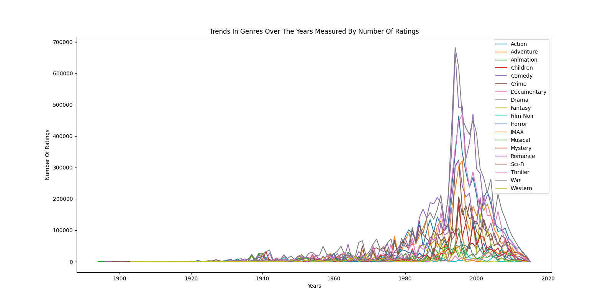
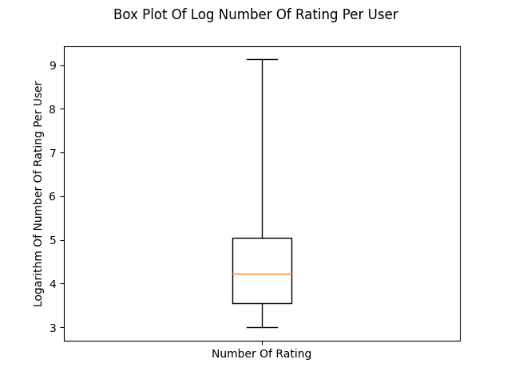
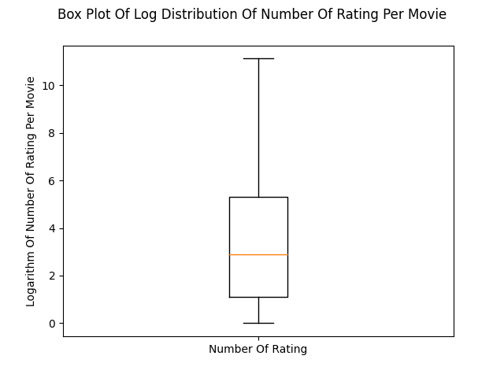
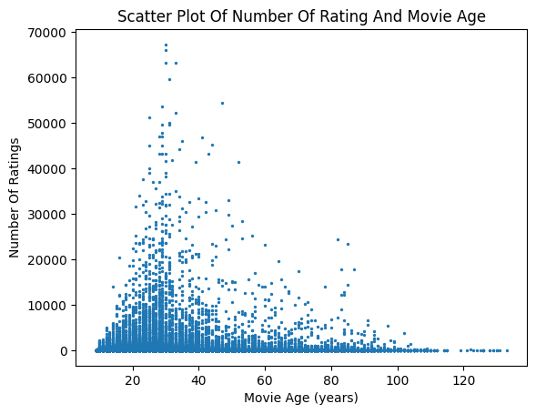

# CS5344 Project

## Dataset
- Download MovieLens 20M from this [link](https://grouplens.org/datasets/movielens/20m/)
- Unzip the file `ml-20m.zip` into the base directory of this repository

## Install dependencies
- Install docker (Refer to Dockerfile for individual dependencies)
- Build docker image and enter docker container via bash
```
bash env.sh
```
- Install additional dependencies inside docker container bash shell
```
pip install numpy matplotlib pandas
```

## Run PySpark
- Run script to fetch recommendations by popularity
```
bash popular_movies.sh
```
- Run command to fetch recommendation by genre prefrences (new users)
```
bash initial_recommendation.sh
```
- Run script to fetch recommendations by matrix factorization
```
bash matrix_factorization.sh
```
- Run script to visualise rating and movie statistics
```
bash movielens_statistics.sh
```
- Run script to fetch recommendation by user comparison
```
bash usersim.sh
```

## MovieLens Data Exploration

### Dataset Information

Statistics | Value
--- | ---
Timespan Of Collection (days) | 7385.78
Timespan Of Collection (years) | 20.22
Number Of Ratings | 20000263
Number Of Movies | 27278
Number Of Genres | 19

### Genres Distribution

Genre | Number Of Movies
--- | ---
Crime | 2939
Romance | 4127
Thriller | 4178
Adventure | 2329
Drama | 13344
War | 1194
Documentary | 2471
Fantasy | 1412
Mystery | 1514
Musical | 1036
Animation | 1027
Film-Noir | 330
IMAX | 196
Horror | 2611
Western | 676
Comedy | 8374
Children | 1139
Action | 3520
Sci-Fi | 1743
(no genres listed) | 246


### Genres Rating Distribution

- Audience does not have a preference of genre on this platform as ratings for each genres does not vary much


### Genre Trends
- Trending genres are Comedy, Drama, Actions



### Genres Distribution By User
- User 3 likes movies of genres Sci-Fi, Action, and Drama


- User 5 likes movies of genres Comedy and Adventure


### Number Of Rating Per User
- Log of number of rating for each user shows the number of movies watched is highly skewed

Percentile | Value
--- | ---
Whislo | 20
Q1 | 35
Med | 68
Q3 | 155
Whishi | 9254
Mean | 144.41



### Number Of Rating Per Movie
- Log distribution of number of rating for each movie shows the number of rating is highly skewed

Percentile | Value
--- | ---
Whislo | 1
Q1 | 3
Med | 18
Q3 | 205
Whishi | 67310
Mean | 747.84



### Number Of Rating Vs Movie Age
- Newer movies tend to have more ratings
- Most movies tend to have few ratings




### Movie Popularity Ranking By Number Of Rating
```
+-------+--------------------+--------------------+-------------------------+
|movieId|               title|              genres|number_of_rating_of_movie|
+-------+--------------------+--------------------+-------------------------+
|    296| Pulp Fiction (1994)|Comedy|Crime|Dram...|                    67310|
|    356| Forrest Gump (1994)|Comedy|Drama|Roma...|                    66172|
|    318|Shawshank Redempt...|         Crime|Drama|                    63366|
|    593|Silence of the La...|Crime|Horror|Thri...|                    63299|
|    480|Jurassic Park (1993)|Action|Adventure|...|                    59715|
|    260|Star Wars: Episod...|Action|Adventure|...|                    54502|
|    110|   Braveheart (1995)|    Action|Drama|War|                    53769|
|    589|Terminator 2: Jud...|       Action|Sci-Fi|                    52244|
|   2571|  Matrix, The (1999)|Action|Sci-Fi|Thr...|                    51334|
|    527|Schindler's List ...|           Drama|War|                    50054|
+-------+--------------------+--------------------+-------------------------+
```

### Movie Popularity Ranking By Average Rating
```
+-------+--------------------+--------------------+-----------------------+
|movieId|               title|              genres|average_rating_of_moive|
+-------+--------------------+--------------------+-----------------------+
|    318|Shawshank Redempt...|         Crime|Drama|      4.446990499637029|
|    858|Godfather, The (1...|         Crime|Drama|      4.364732196832306|
|     50|Usual Suspects, T...|Crime|Mystery|Thr...|      4.334372207803259|
|    527|Schindler's List ...|           Drama|War|      4.310175010988133|
|   1221|Godfather: Part I...|         Crime|Drama|      4.275640557704942|
|   2019|Seven Samurai (Sh...|Action|Adventure|...|        4.2741796572216|
|    904|  Rear Window (1954)|    Mystery|Thriller|      4.271333600779414|
|   7502|Band of Brothers ...|    Action|Drama|War|      4.263182346109176|
|    912|   Casablanca (1942)|       Drama|Romance|      4.258326830670664|
|    922|Sunset Blvd. (a.k...|Drama|Film-Noir|R...|      4.256934865900383|
+-------+--------------------+--------------------+-----------------------+
```

### Movie Popularity Ranking By Standard Deviation (Polarized Rating)
```
+-------+--------------------+--------------------+----------------------------------+
|movieId|               title|              genres|standard_deviation_rating_of_movie|
+-------+--------------------+--------------------+----------------------------------+
|  62912|High School Music...|             Musical|                 1.532495448528717|
|  27899|What the #$*! Do ...|Comedy|Documentar...|                1.4221290413577286|
|   1924|Plan 9 from Outer...|       Horror|Sci-Fi|                1.4201711823223824|
|    834|   Phat Beach (1996)|              Comedy|                1.4106438635735048|
|   2964|Julien Donkey-Boy...|               Drama|                 1.392895821170451|
|  46062|High School Music...|Children|Comedy|D...|                 1.390068836660452|
|   2158|Henry: Portrait o...|        Crime|Horror|                1.3701829657162357|
|   2362|Glen or Glenda (1...|               Drama|                 1.369188505982515|
|  91104|Twilight Saga: Br...|Adventure|Drama|F...|                 1.353614474548174|
|   4255|Freddy Got Finger...|              Comedy|                1.3504497277537102|
+-------+--------------------+--------------------+----------------------------------+
```


## Issues
- Solve java.lang.OutOfMemoryError: Java heap space (https://stackoverflow.com/questions/50842877/java-lang-outofmemoryerror-java-heap-space-using-docker)
