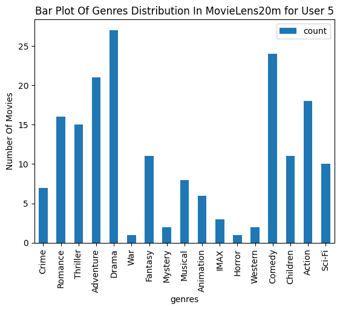

# CS5344 Project

## Dataset
- Download MovieLens 20M from this [link](https://grouplens.org/datasets/movielens/20m/)
- Unzip the file `ml-20m.zip` into the base directory of this repository

## Install dependencies
- Install docker (Refer to Dockerfile for individual dependencies)
- Build docker image and enter docker container via bash
```
bash env.sh
```
- Install additional dependencies inside docker container bash shell
```
pip install numpy matplotlib pandas
```

## Run PySpark
- Run main script to fetch all recommendations
```
bash run.sh
```
- Run script to fetch recommendations by popularity
```
bash popular_movies.sh
```
- Run script to fetch recommendations by matrix factorization
```
bash matrix_factorization.sh
```
- Run script to visualise rating and movie statistics
```
bash movielens_statistics.sh
```

## MovieLens Data Exploration

### Dataset Information

Statistics | Value
--- | ---
Timespan Of Collection (days) | 7385.78
Timespan Of Collection (years) | 20.22
Number Of Ratings | 20000263
Number Of Movies | 27278
Number Of Genres | 19

### Genres Distribution

Genre | Number Of Movies
--- | ---
Crime | 2939
Romance | 4127
Thriller | 4178
Adventure | 2329
Drama | 13344
War | 1194
Documentary | 2471
Fantasy | 1412
Mystery | 1514
Musical | 1036
Animation | 1027
Film-Noir | 330
IMAX | 196
Horror | 2611
Western | 676
Comedy | 8374
Children | 1139
Action | 3520
Sci-Fi | 1743
(no genres listed) | 246


### Genres Rating Distribution

- Audience does not have a preference of genre on this platform as ratings for each genres does not vary much


### Genres Distribution By User
- User 3 likes movies of genres Sci-Fi, Action, and Drama


- User 5 likes movies of genres Comedy and Adventure




### Number Of Rating
- Log distribution of number of rating for each movie shows the number of rating is highly skewed

Percentile | Value
--- | ---
Whislo | 1
Q1 | 3
Med | 18
Q3 | 205
Whishi | 67310
Mean | 747.84


### Movie Popularity Ranking By Number Of Rating
```
+-------+--------+------------------+------------------+--------------------+--------------------+
|movieId|n_rating|        avg_rating|        std_rating|               title|              genres|
+-------+--------+------------------+------------------+--------------------+--------------------+
|    296|   67310| 4.174231169217055|0.9760762295742446| Pulp Fiction (1994)|Comedy|Crime|Dram...|
|    356|   66172| 4.029000181345584|0.9480175852362239| Forrest Gump (1994)|Comedy|Drama|Roma...|
|    318|   63366| 4.446990499637029|0.7175246678619936|Shawshank Redempt...|         Crime|Drama|
|    593|   63299|  4.17705650958151|0.8424209875720274|Silence of the La...|Crime|Horror|Thri...|
|    480|   59715|3.6647408523821485|0.9278183557721543|Jurassic Park (1993)|Action|Adventure|...|
|    260|   54502| 4.190671901948552|0.9185218871153663|Star Wars: Episod...|Action|Adventure|...|
|    110|   53769| 4.042533802004873|0.9550580817394759|   Braveheart (1995)|    Action|Drama|War|
|    589|   52244|3.9319539085828037|0.9030867333395624|Terminator 2: Jud...|       Action|Sci-Fi|
|   2571|   51334| 4.187185880702848|0.8879287185997589|  Matrix, The (1999)|Action|Sci-Fi|Thr...|
|    527|   50054| 4.310175010988133|0.8254213213619155|Schindler's List ...|           Drama|War|
+-------+--------+------------------+------------------+--------------------+--------------------+
```

### Movie Popularity Ranking By Average Rating
```
+-------+--------+-----------------+------------------+--------------------+--------------------+
|movieId|n_rating|       avg_rating|        std_rating|               title|              genres|
+-------+--------+-----------------+------------------+--------------------+--------------------+
|    318|   63366|4.446990499637029|0.7175246678619936|Shawshank Redempt...|         Crime|Drama|
|    858|   41355|4.364732196832306|0.8398766296526564|Godfather, The (1...|         Crime|Drama|
|     50|   47006|4.334372207803259|0.7567833836397737|Usual Suspects, T...|Crime|Mystery|Thr...|
|    527|   50054|4.310175010988133|0.8254213213619155|Schindler's List ...|           Drama|War|
|   1221|   27398|4.275640557704942|0.8644986011840312|Godfather: Part I...|         Crime|Drama|
|   2019|   11611|  4.2741796572216|0.8374523042319978|Seven Samurai (Sh...|Action|Adventure|...|
|    904|   17449|4.271333600779414| 0.752636397416788|  Rear Window (1954)|    Mystery|Thriller|
|   7502|    4305|4.263182346109176|0.9057353399354419|Band of Brothers ...|    Action|Drama|War|
|    912|   24349|4.258326830670664|0.8633803744007282|   Casablanca (1942)|       Drama|Romance|
|    922|    6525|4.256934865900383|0.8319934893722168|Sunset Blvd. (a.k...|Drama|Film-Noir|R...|
+-------+--------+-----------------+------------------+--------------------+--------------------+
```

### Movie Popularity Ranking By Standard Deviation (Polarized Rating)
```
+-------+--------+------------------+------------------+--------------------+--------------------+
|movieId|n_rating|        avg_rating|        std_rating|               title|              genres|
+-------+--------+------------------+------------------+--------------------+--------------------+
|   1311|     148|2.6655405405405403|1.7827485024071903|Santa with Muscle...|              Comedy|
|  74754|     156| 2.426282051282051|1.7568341093215845|    Room, The (2003)|Comedy|Drama|Romance|
|    843|      58|3.3275862068965516|1.6344743350958786|   Lotto Land (1995)|               Drama|
|  50703|      86| 2.686046511627907|1.6324764868641013|  Secret, The (2006)|         Documentary|
|  59295|     127|2.1338582677165356|1.6274539699164998|Expelled: No Inte...|         Documentary|
|  70946|     111| 2.018018018018018|1.6024525633709776|      Troll 2 (1990)|      Fantasy|Horror|
|  26157|      55|1.7363636363636363|1.5777813344674667|Manos: The Hands ...|              Horror|
|  51372|     155|2.7483870967741937|1.5732898296703357|"""Great Performa...|             Musical|
|   1421|     194|3.0257731958762886|1.5578168828592593|Grateful Dead (1995)|         Documentary|
|  62912|     272|2.3253676470588234| 1.532495448528717|High School Music...|             Musical|
+-------+--------+------------------+------------------+--------------------+--------------------+
```


## Issues
- Solve java.lang.OutOfMemoryError: Java heap space (https://stackoverflow.com/questions/50842877/java-lang-outofmemoryerror-java-heap-space-using-docker)
